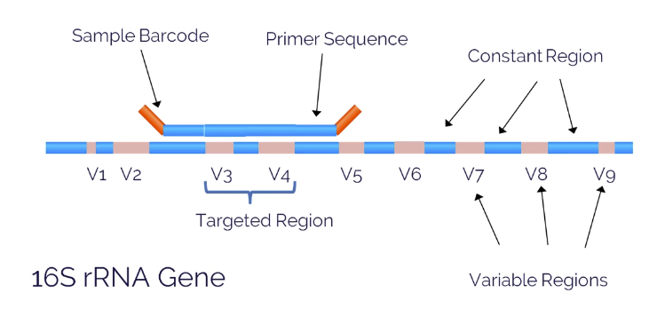

# Foundations of metagenomics

**Metagenomics** is the sequencing of _all_ DNA in sample, including environmental (e.g. microbial) DNA.

## 16S sequencing

### Main takeaways
- 16S sequencing tells you what bacteria are in your sample.

### About 16S
- Pros of 16S sequencing
  - Cheap
- Limitations of 16S sequencing
  - Can only get relative proportions of bacterial types; **not quantitative**

### How 16S sequencing works

_Watch [this introductory video](https://www.youtube.com/watch?v=cRLlrzh7lRI) on what 16S rRNA gene sequencing is, why it is useful, and how it works._

16S gene has many constant (i.e. conserved) regions, and many variable regions. The constant regions allow us to create primers that can anneal to the DNA of _many types of bacteria_, and the variable regions, once sequenced, let us identify _specific species of bacteria_.

